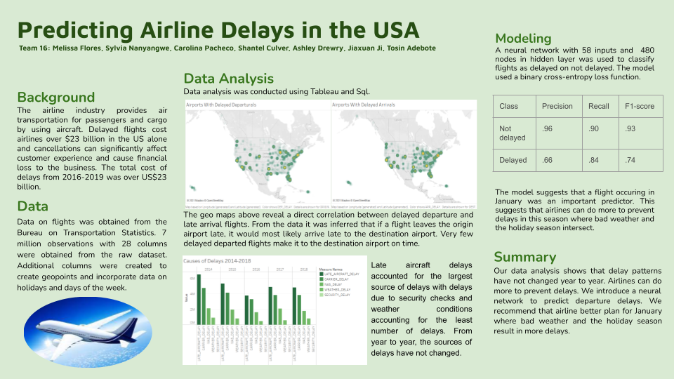

<ul>
  
    <li>
      <a href="{{ post.url | relative_url }}">{{ post.title }}</a>
    </li>
  
</ul>

## Melissa Flores

    
Climate & Energy Research. Product Development. Data Science.

### About Me
I'm a graduate student at ETH Zurich. I'm interested in how data can be used to inform climate and energy policy. I have experience working with climate models, energy data, and cloud computing.

### Resume

 One-pager 

  

[My 2-page CV](resume.md)
  
### Data Science Projects

 Flight Delay Prediction 

    
As a fellow at the Data Science 4 All / Women Program, I primarily worked to predict flight delays using neural networks. I'm working on improving the prediction and will share my results here.
    <a href="https://github.com/drewrya/DS4A---Team-16/blob/main/ds4a%20-%20Fall%202021%20-%20Team%2016%20Final%20Report.docx"> See our team's report here. </a> 
    

  

  

 Using NLP to Study Local Solar Energy Laws 

    
As a graduate student, I collected labeled data and used this to develop a keyword approach to identify laws that encourage and discourage solar energy adoption. <a href="https://drive.google.com/file/d/1VeLTsGpYlRdvVk8WOwddsJMYXTvCHHmy/view?usp=sharing"> Read my thesis here. </a> 

  

 Predicting 911 Call Severity 

    
I worked with a team of students in ETH Zurich's Business Analytics course to predict 911 call severity using location and weather data. I primarily worked on cleaning data and developing a multinomial regression model. 

  

  
  
### Contact Me

 Contact Form 

    <iframe src="https://docs.google.com/forms/d/e/1FAIpQLSf1j35ZGA5lWuwvC71o-zztvhs9w7_NQuiW639oNsROPqrYZA/viewform?embedded=true" width="640" height="707" frameborder="0" marginheight="0" marginwidth="0">Loading…</iframe>
      

### Resources
[Free Resources for Learning Data Science](resources.md)
